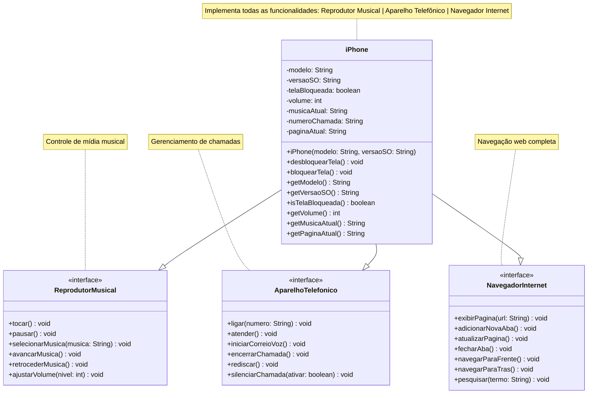

# java-uml-iphone

```mermaid
classDiagram
    %% Interfaces
    class ReprodutorMusical {
        <<interface>>
        +tocar() void
        +pausar() void
        +selecionarMusica(musica: String) void
        +avancarMusica() void
        +retrocederMusica() void
        +ajustarVolume(nivel: int) void
    }

    class AparelhoTelefonico {
        <<interface>>
        +ligar(numero: String) void
        +atender() void
        +iniciarCorreioVoz() void
        +encerrarChamada() void
        +rediscar() void
        +silenciarChamada(ativar: boolean) void
    }

    class NavegadorInternet {
        <<interface>>
        +exibirPagina(url: String) void
        +adicionarNovaAba() void
        +atualizarPagina() void
        +fecharAba() void
        +navegarParaFrente() void
        +navegarParaTras() void
        +pesquisar(termo: String) void
    }

    %% Classe Principal
    class iPhone {
        -modelo: String
        -versaoSO: String
        -telaBloqueada: boolean
        -volume: int
        -musicaAtual: String
        -numeroChamada: String
        -paginaAtual: String

        +iPhone(modelo: String, versaoSO: String)
        +desbloquearTela() void
        +bloquearTela() void
        +getModelo() String
        +getVersaoSO() String
        +isTelaBloqueada() boolean
        +getVolume() int
        +getMusicaAtual() String
        +getPaginaAtual() String
    }

    %% Relações de Implementação
    iPhone --|> ReprodutorMusical
    iPhone --|> AparelhoTelefonico
    iPhone --|> NavegadorInternet

    %% Notas Adicionais
    note for iPhone "Implementa todas as funcionalidades:  Reprodutor Musical | Aparelho Telefônico |  Navegador Internet"
    note for ReprodutorMusical "Controle de mídia musical"
    note for AparelhoTelefonico "Gerenciamento de chamadas"
    note for NavegadorInternet "Navegação web completa"
```
